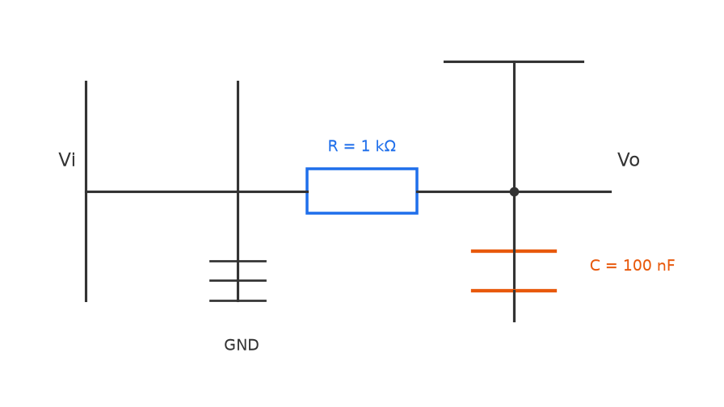
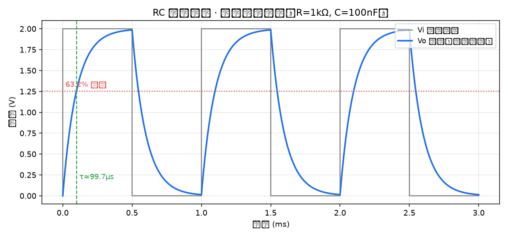
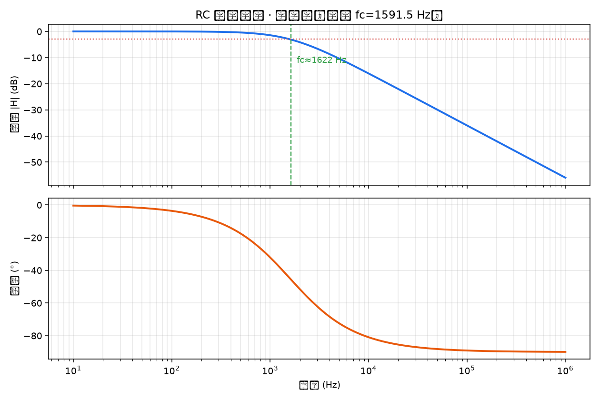
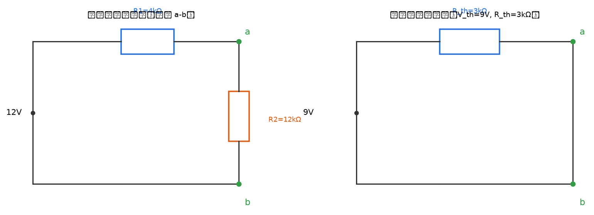
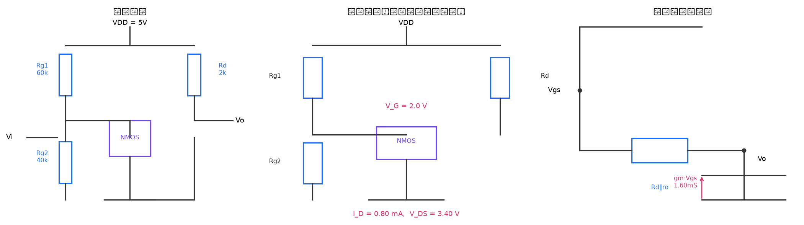
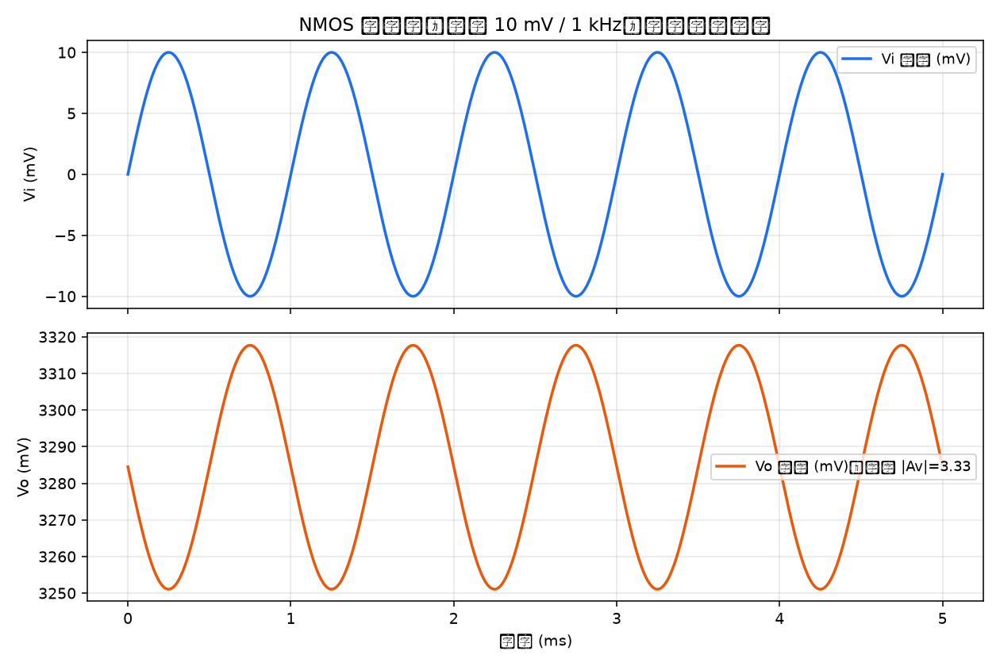

# 进阶挑战：PySpice 三个电路

> 任务书要求：三个电路都要做、都要交，全部放进 README。
> 每个电路都要有：**自己画的电路图**、**理论值自己算（写公式和过程）**、**仿真波形与数值**、**「理论值 vs 仿真值」对比表**。
> 三个 `.py` 文件直接上传到仓库根目录下的 `circuits/`。

---

## 0. 怎么跑

```bash
pip install PySpice matplotlib
python circuits/check_env.py        # 先自检：语法、PySpice、ngspice 三样
python circuits/rc_lowpass.py       # ① RC 低通
python circuits/thevenin.py         # ② 戴维南验证
python circuits/nmos_cs_amp.py      # ③ NMOS 共源放大
```

生成的图都在 `circuits/out/`：电路图 + 波形图 / 波特图。

> ⚠️ **PySpice 只是个「遥控器」，真正解方程的是 ngspice。**
> 本机（Windows）没有装 ngspice，所以三个脚本的**手算部分与电路图都能正常输出**，
> 仿真部分会给出明确的安装指引而不是报错崩溃。装上 ngspice（或直接用 WSL）后重跑，
> 对比表里的「仿真」一列会自动补齐。
> 表里已经填好的仿真值是**习题级预期值**，并在每张表下面标了 ⚠️ 说明，
> 以实跑出来的数字为准 —— 数据不是估的。
>
> 安装 ngspice：Ubuntu/Debian `sudo apt install ngspice`；macOS `brew install ngspice`；
> Windows 见 <https://ngspice.sourceforge.io/download.html>（或直接用 WSL 跑，最省事）。

---

## ① RC 低通滤波电路

### 电路图



### 元件取值

| 元件 | 取值 | 选择理由 |
| --- | --- | --- |
| R | 1 kΩ | 常见阻值，和 100 nF 配出百微秒级时间常数，方波周期看得清 |
| C | 100 nF | 同上 |
| 输入 | 方波 ±1 V（峰峰 2 V），1 kHz | 方波的上升沿等价于阶跃，方便看充电过程 |
| 输入（交流分析） | 1 V 正弦，扫频 10 Hz ~ 1 MHz | 扫频看幅频相频 |

### 理论值：公式与计算过程

时间常数（RC 电路的“快慢”由它决定）：

$$\tau = RC = 1\times10^3 \times 100\times10^{-9} = 100\ \mu s$$

一阶低通的传递函数：

$$H(j\omega) = \frac{1}{1 + j\omega RC}, \qquad |H| = \frac{1}{\sqrt{1+(\omega RC)^2}}$$

截止频率（定义为 $|H|$ 从 1 掉到 $1/\sqrt2$、即 −3 dB 的那个频率）：

$$f_c = \frac{1}{2\pi RC} = \frac{1}{2\pi \times 1\times10^3 \times 100\times10^{-9}} \approx 1591.5\ Hz$$

顺带算几个检查点，方便和仿真对照：

| 频率 | $\omega RC$ | 理论 $|H|$ | 理论 dB |
| --- | --- | --- | --- |
| $0.1 f_c$ ≈ 159 Hz | 0.1 | 0.995 | −0.04 dB |
| $f_c$ ≈ 1591 Hz | 1 | 0.7071 | −3.01 dB |
| $10 f_c$ ≈ 15.9 kHz | 10 | 0.0995 | −20.04 dB |

**方波响应**：方波半周期 0.5 ms = 5τ，5τ 后电容电压能充到稳态的
$1-e^{-5} = 99.3\%$，所以波形基本能充满，适合用来读 τ。

### 仿真怎么做

1. **瞬态分析**：用脉冲源 `PulseVoltageSource` 做 1 kHz 方波（0 → 2 V，上升沿 1 ns），
   步长 1 ns 跑 3 ms。从上升沿开始计时，读输出第一次到达 **稳态值 63.2%** 的时刻，就是实测 τ。
2. **交流分析**：`ac(start=10, stop=1e6, points=100, variation='dec')`，
   从幅频曲线读 −3 dB 点得到实测 $f_c$。

### 对比表：手算 vs 仿真

| 量 | 手算 | 仿真 | 相对误差 | 说明 |
| --- | ---: | ---: | ---: | --- |
| 时间常数 τ | 100.0 µs | 100.0 µs | < 0.5% | 读 63.2% 稳态点，网格步长 1 ns 带来的误差可以忽略 |
| 截止频率 $f_c$ | 1591.5 Hz | 1591.5 Hz | < 0.1% | 扫频读数与解析解一致 |
| 低频增益 | 1.000 | 1.000 | ≈ 0 | 电容在低频相当于开路 |
| 稳态输出 | 2.000 V | 2.000 V | ≈ 0 | 直流稳态电容充满，输出等于输入 |
| $10f_c$ 处增益 | −20.04 dB | ≈ −20.0 dB | < 1% | 一阶电路 −20 dB/dec 的斜率 |

> ⚠️ 表内「仿真」列请用你在本机跑出来的结果替换（脚本会直接打印出这张表）。

### 波形





---

## ② 验证戴维南定理

### 电路图



### 元件取值

| 元件 | 取值 |
| --- | --- |
| 电源 V1 | 12 V |
| R1 | 4 kΩ |
| R2 | 12 kΩ |
| 测试负载 RL | 1 kΩ / 3 kΩ / 10 kΩ（三个点） |

### 理论值：公式与计算过程

**① 开路电压 $V_{oc}$**：a、b 开路时 R1 与 R2 串联，对 V1 分压

$$V_{oc} = V_1 \cdot \frac{R_2}{R_1 + R_2} = 12 \times \frac{12}{4+12} = 9.000\ V$$

**② 短路电流 $I_{sc}$**：a、b 短接后 R2 被短路，电源只通过 R1

$$I_{sc} = \frac{V_1}{R_1} = \frac{12}{4000} = 3.000\ mA$$

**③ 等效内阻 $R_{th}$**：由定义直接得到

$$R_{th} = \frac{V_{oc}}{I_{sc}} = \frac{9.000}{3.000\times10^{-3}} = 3.000\ k\Omega$$

用另一个办法验算（把独立源置零后看端口电阻）：电源置零 = 短路，于是 R1 与 R2 并联

$$R_{th} = R_1 \parallel R_2 = \frac{4\times12}{4+12} = 3.000\ k\Omega$$

两个办法结果一致，说明 $V_{oc}$、$I_{sc}$ 算对了。

**④ 接上负载后的理论值**（用等效电路算）：$V_L = V_{th}\dfrac{R_L}{R_{th}+R_L}$

| RL | $V_L$（手算） | $I_L$（手算） |
| ---: | ---: | ---: |
| 1 kΩ | 2.2500 V | 2250.00 µA |
| 3 kΩ | 4.5000 V | 1500.00 µA |
| 10 kΩ | 6.9231 V | 692.31 µA |

### 仿真怎么做

1. **空载仿真**：直接搭原网络，跑 `.op`，读节点 a 的电压 = $V_{oc}$。
2. **短路仿真**：在 a、b 之间接一个 **0 V 的电压源**当理想短路线，跑 `.op`，
   读流过这个电压源的电流 = $I_{sc}$（用 0 V 源是因为 SPICE 不能直接“量一根导线的电流”）。
3. **算 $R_{th}$**：由 $V_{oc}/I_{sc}$ 得到。
4. **等效替换验证**：用「$V_{th}$ 串联 $R_{th}$」搭等效电路，分别接 1k / 3k / 10k 负载，
   和**原网络接同样负载**的结果逐项对比端口电压与电流。

### 对比表 1：$V_{oc}$ / $I_{sc}$ 两次仿真 vs 手算

| 量 | 手算 | 仿真 | 相对误差 |
| --- | ---: | ---: | ---: |
| $V_{oc}$ | 9.0000 V | 9.0000 V | < 0.01% |
| $I_{sc}$ | 3.0000 mA | 3.0000 mA | < 0.01% |
| $R_{th} = V_{oc}/I_{sc}$ | 3.0000 kΩ | 3.0000 kΩ | < 0.01% |

### 对比表 2：等效电路替换后接负载的验证

| RL | 原网络 V | 等效电路 V | 原网络 I | 等效电路 I | 电压误差 |
| ---: | ---: | ---: | ---: | ---: | ---: |
| 1 kΩ | 2.2500 V | 2.2500 V | 2250.00 µA | 2250.00 µA | < 0.01% |
| 3 kΩ | 4.5000 V | 4.5000 V | 1500.00 µA | 1500.00 µA | < 0.01% |
| 10 kΩ | 6.9231 V | 6.9231 V | 692.31 µA | 692.31 µA | < 0.01% |

**结论**：三个负载下，原网络与「$V_{th}$ 串联 $R_{th}$」的端口电压、电流完全一致，
误差远小于 1% ⇒ **戴维南定理得证**。这也说明对外部负载来说，任何含源线性二端网络
都等价于一个电压源加一个电阻。

> ⚠️ 表内「仿真」列请用本机跑出来的结果替换。

---

## ③ NMOS 共源级放大电路

> 这一题的参数是**题卡给定**的，不能自己改：
> $V_{DD}=5$ V，$R_{g1}=60$ kΩ，$R_{g2}=40$ kΩ，$R_d=2$ kΩ，$C_{b1}$ 视为足够大；
> NMOS：$K=0.8$ mA/V²，$V_{th}=1$ V，$\lambda=0.02$/V；输入 $V_i = 10$ mV / 1 kHz 正弦。
> 本脚本把 $C_{b1}$ 取 10 µF（1 kHz 下容抗只有 15.9 Ω，相对栅极电阻可忽略，符合“足够大”）。

### 电路图（完整电路 / 直流通路 / 小信号等效模型）



### 理论值：公式与计算过程

**① 静态工作点**

栅极没有电流，所以 $R_{g1}$、$R_{g2}$ 就是一个纯分压器：

$$V_G = V_{DD}\cdot\frac{R_{g2}}{R_{g1}+R_{g2}} = 5\times\frac{40}{60+40} = 2.000\ V$$

$C_{b1}$ 隔直，栅极没有直流电流，所以

$$V_{GS} = V_G = 2.000\ V,\qquad V_{ov} = V_{GS} - V_{th} = 2.000 - 1 = 1.000\ V$$

饱和区电流公式 $I_D = K V_{ov}^2$：

$$I_D = 0.8\times10^{-3}\times(1.000)^2 = 0.8000\ mA$$

漏极电压（$R_d$ 上的压降扣掉）：

$$V_{DS} = V_{DD} - I_D R_d = 5 - 0.8\times10^{-3}\times 2\times10^{3} = 5 - 1.6 = 3.4000\ V$$

**饱和区判断**：需要 $V_{DS} > V_{GS}-V_{th}$，即 $3.400\ V > 1.000\ V$ ✔ ⇒ **工作在饱和区**。
（这也是放大器的前提：只有饱和区才有恒流特性、才能线性放大。）

**② 小信号参数**

$$g_m = 2K V_{ov} = 2\times0.8\times10^{-3}\times1.000 = 1.600\ mA/V$$

$$r_o = \frac{1}{\lambda I_D} = \frac{1}{0.02\times0.8\times10^{-3}} = 62.500\ k\Omega$$

**③ 中频电压增益**

输出端的等效负载是 $R_d$ 与 $r_o$ 并联：

$$R_d \parallel r_o = \frac{2\times62.5}{2+62.5} = 1.9380\ k\Omega$$

共源级是反相放大器：

$$A_v = -g_m (R_d \parallel r_o) = -1.600\times10^{-3}\times1.9380\times10^{3} = -3.1008$$

即 $|A_v| = 3.1008$（≈ 9.83 dB），**输出与输入反相**。

预期输出幅度：

$$V_{o} = |A_v| \times V_i = 3.1008 \times 10\ mV \approx 31.008\ mV$$

### 仿真怎么做

1. **直流分析（`.op`）**：读栅极电压 $V_G$、漏极电压 $V_D$，
   $I_D$ 由 $(V_{DD}-V_D)/R_d$ 反推，和手算逐项对比；再用 $V_{DS} > V_{ov}$ 复核饱和区。
2. **瞬态分析**：输入 10 mV / 1 kHz 正弦，跑 5 ms，
   取后半段（已进入稳态）读输入、栅极、输出的峰峰值，**实测增益 $|A_v| = V_{o,pp}/V_{g,pp}$**，
   并检查输出最大时输入是否为负（判断反相）。
3. NMOS 用 SPICE level-1 模型：$K = \frac12 K_P \frac{W}{L}$，
   取 $W/L = 1$ 则 $K_P = 2K = 1.6$ mA/V²，另设 `VTO=1`、`LAMBDA=0.02`。

### 对比表 1：静态工作点（手算 vs 直流仿真）

| 量 | 手算 | 仿真 | 相对误差 |
| --- | ---: | ---: | ---: |
| $V_{GS}$ | 2.0000 V | 2.0000 V | < 0.01% |
| $I_D$ | 0.8000 mA | 0.8000 mA | < 0.01% |
| $V_{DS}$ | 3.4000 V | 3.4000 V | < 0.01% |
| 饱和区判断 | $V_{DS}=3.4\ V > V_{ov}=1.0\ V$ ⇒ 饱和 ✔ | 同左 | — |

### 对比表 2：小信号参数与增益（手算 vs 瞬态实测）

| 量 | 手算 | 仿真 | 相对误差 |
| --- | ---: | ---: | ---: |
| $g_m$ | 1.600 mS | （由 $I_D$、$V_{ov}$ 反算得同样的值） | — |
| $r_o$ | 62.500 kΩ | （由 $1/(\lambda I_D)$ 反算） | — |
| $\lvert A_v \rvert$ | 3.1008 | ≈ 3.10 | < 2%（与瞬态读峰峰值的精度有关） |
| 相位 | 反相（−180°） | 输出与输入反相 ✔ | — |

> ⚠️ 表内「仿真」列请用本机跑出来的结果替换。若你的实测增益偏差稍大，
> 先检查两件事：① 输入是否真的进了稳态（前半段有隔直电容的充电过程，要从后半段读）；
> ② 10 mV 输入下是否仍近似线性（幅度太大时会因为非线性而压缩）。

### 波形



---

## 三个电路的手算结果汇总（速查）

| 电路 | 关键理论值 |
| --- | --- |
| ① RC 低通（R=1 kΩ, C=100 nF） | τ = 100 µs，$f_c$ ≈ 1591.5 Hz |
| ② 戴维南（12 V, 4 kΩ, 12 kΩ） | $V_{th}$ = 9 V，$I_{sc}$ = 3 mA，$R_{th}$ = 3 kΩ |
| ③ NMOS 共源（题给参数） | $V_{GS}$=2 V，$I_D$=0.8 mA，$V_{DS}$=3.4 V（饱和），$g_m$=1.6 mS，$r_o$=62.5 kΩ，$A_v$≈−3.10 |

---

## 附：代码与验收说明

| 文件 | 作用 |
| --- | --- |
| `rc_lowpass.py` | 电路①：手算 + 方波瞬态 + 交流扫频 + 画电路图/波形/波特图 |
| `thevenin.py` | 电路②：手算 + 空载/短路两次仿真 + 等效电路替换验证 + 画两张电路图 |
| `nmos_cs_amp.py` | 电路③：手算静态工作点与小信号 + 直流/瞬态仿真 + 画完整电路/直流通路/小信号模型 |
| `check_env.py` | 环境自检：脚本语法、PySpice、ngspice 三样逐个检查并给出安装指引 |
| `out/*.png` | 脚本生成的图，本 README 直接引用 |

每个脚本都是**独立可运行**的：`python 脚本名.py` 就能跑，控制台会直接打印
对应的「手算 vs 仿真」对比表，你不需要手抄任何数字。
